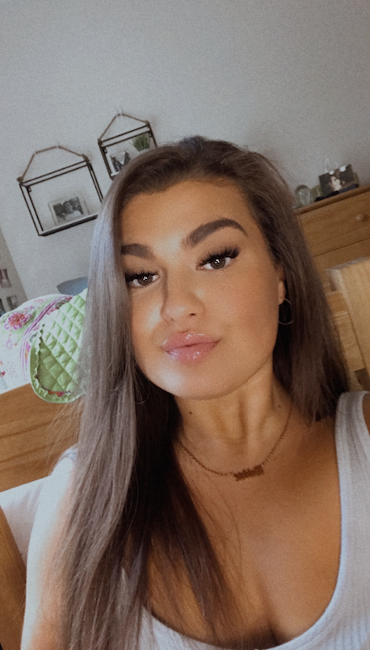

# GABRIELLE DOSTER

Hello, welcome to my personal portfolio! 

## ABOUT ME 
 

My name is Gabbie Doster. I'm 20 years old, from Buffalo, NY. I'm currently a junior at Penn State Behrend in Erie, Pennsylvania. My major is Digital Media, Arts, and Technology but, I'm thinking about switching it to Communications. Before Behrend, I attended Erie Community College back in Buffalo. Being a transfer student has really helped open my eyes to the many opportunites I have. I'm passionate about film and videography. I also love taking pictures! Photography holds a special place in my heart. My dream job would be either a director/producer or cinematographer. 

## [RESUME](RESUME.md) 

### _CONTACT INFO_
grd5165@psu.edu
(716) 449-7236

### _EXPERIENCE_
**West Seneca West Senior High School** West Seneca, NY - Film maker/Editor
August 2018 through Novemeber 2019
Worked as Filmmaker and Film Editor for school's varsity football program in order to learn all aspects of film-making business. Developed, filmed, edited and produced well over 100 hours of footage for two seprate sports documentaries. Performed smooth and professional final edits using Final Cut Pro X to create videos for multimedia platforms via YouTube and Twitter. 

**McDonalds** Orchard Park, NY - Employee/Crew Trainer
December 2015 through present (not an employee while away at school)
Works as an employee and crew trainer. Consistently has had a steady job and responsibility at this company for well over 4 to 5 years.

### _EDUCATION_
**Erie Community College** Buffalo, NY
Associates degree of Arts: Digital Communications and Multimedia
Sepetember 2018 through May 2020
GPA: 3.6

**Penn State Behrend** Erie, PA
Undergraduate
Field of Study: Digital Media, Arts, and Technology
August 2020 through present

### _SKILLS_
- Final Cut Pro X
- Adobe Premiere
- Adobe Photoshop
- IMovie
- Social Media via Instagram, Twitter, YouTube 
- Pre- and Post-production proficiency 
- Strategic Planning 
- Great Communication
- Collaborative
- Project Management
- Highly Organized
- Deadline-driven 
- Self-starter
- Valid Passport

### _AWARDS_
In November of 2017, WBBZ-TV asked to use one of my videos on their news station.
Featured in a three page article of the October 2018 West Seneca Sun.

### _LANGUAGES_
Native English
Limited working Spanish

## PHOTOGRAPHY

   

These four images were a duo sets that I made Photoshop. The first two represent the light and darkness of a person. The last two share the connection of curiosity. The glowing ball represents the sense of wonder and imagination.  

Some people may think heaven is a large blooming field of sunshine and flowers, but my idea is that heaven is free roaming above the clouds. This image was created with Adobe Photoshop.

 

The first image was made with creative freestyling on Photoshop. The second image is a portrait with the idea of imagination within nature. 

## VIDEO PROJECTS

<iframe src="https://www.youtube.com/watch?v=Asgz1kc_olE{{ include.id }}" 
    width="560" 
    height="315"
    frameborder="0" 
    allowfullscreen>
</iframe>

