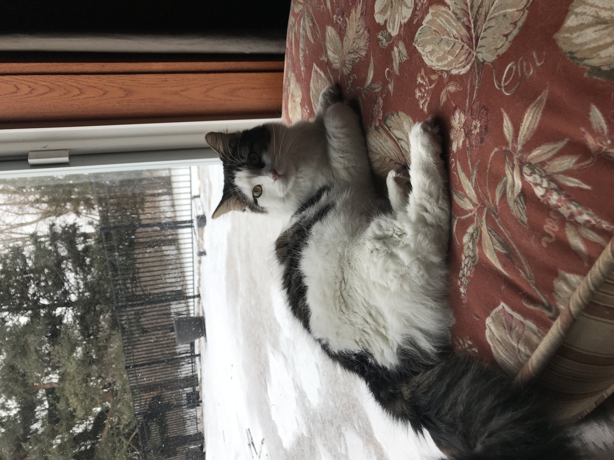

### Gabbie Doster

Hello, welcome to my personal portfolio! 

## ABOUT ME: 
 
My name is Gabbie Doster. I'm 20 years old, from Buffalo, NY. I'm currently a junior at Penn State Behrend in Erie, Pennsylvania. My major is Digital Media, Arts, and Technology but, I'm thinking about switching it to Communications. Before Behrend, I attended Erie Community College back in Buffalo. Being a transfer student has really helped open my eyes to the many opportunites I have. I'm passionate about film and videography. I also love taking pictures! Photography holds a special place in my heart. My dream job would be either a director/producer or cinematographer. 

## RESUME: 


You can use the [editor on GitHub](https://github.com/gabbiedoster/Test1/edit/master/docs/index.md) to maintain and preview the content for your website in Markdown files.
 This is my cat Millie.

Whenever you commit to this repository, GitHub Pages will run [Jekyll](https://jekyllrb.com/) to rebuild the pages in your site, from the content in your Markdown files.

### Markdown

Markdown is a lightweight and easy-to-use syntax for styling your writing. It includes conventions for

```markdown
Syntax highlighted code block


## Header 2
### Header 3

- Bulleted
- List

1. Numbered
2. List

**Bold** and _Italic_ and `Code` text

[Link](url) and 
```

For more details see [GitHub Flavored Markdown](https://guides.github.com/features/mastering-markdown/).

### Jekyll Themes

Your Pages site will use the layout and styles from the Jekyll theme you have selected in your [repository settings](https://github.com/gabbiedoster/Test1/settings). The name of this theme is saved in the Jekyll `_config.yml` configuration file.

### Support or Contact

Having trouble with Pages? Check out our [documentation](https://docs.github.com/categories/github-pages-basics/) or [contact support](https://github.com/contact) and we’ll help you sort it out.
